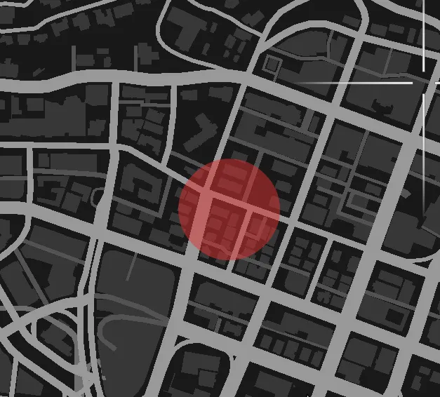

## ADD_BLIP_FOR_RADIUS

```c
// 0x46818D79B1F7499A 0x4626756C
Blip ADD_BLIP_FOR_RADIUS(float posX, float posY, float posZ, float radius);
```
Create a blip with a radius for the specified coordinates (it doesnt create the blip sprite, so you need to use [AddBlipCoords](#_0xC6F43D0E))

Example image:


## Parameters
* **posX**: The x position of the blip (you can also send a vector3 instead of the bulk coordinates)
* **posY**: The y position of the blip (you can also send a vector3 instead of the bulk coordinates)
* **posZ**: The z position of the blip (you can also send a vector3 instead of the bulk coordinates)
* **radius**: The number that defines the radius of the blip circle

## Return value
The blip handle that can be manipulated with every `SetBlip` natives

## Examples
```lua
local coords = vector3(0.0, 0.0, 0.0)

local blip = AddBlipForRadius(coords, 100.0) -- need to have .0
SetBlipColour(blip, 1)
SetBlipAlpha(blip, 128)
```

```js  
const blip = AddBlipForRadius(0.0, 0.0, 0.0, 100.0);
SetBlipColour(blip, 1);
SetBlipAlpha(blip, 128);
```
